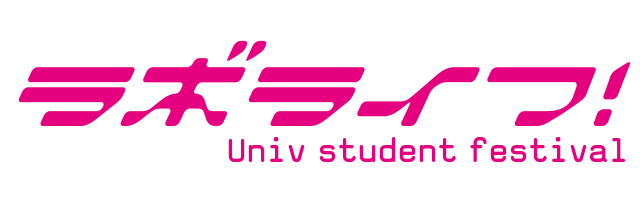

 

Problem Statement
==
カズノリ君は「ラボライフ！」というゲームの熱狂的なプレイヤーである。

このゲームはLP（ラボチク・ポイント）を消費してプレイをする。
LPは時間とともに回復するが、課金アイテムであるラボ<ruby><rb>力</rb><rp>《</rp><rt>りょく</rt><rp>》</rp></ruby>ドリンクを使うと、瞬時にLPを全回復することができ、ゲームを有利に進めることができる。

明日から、新しいイベント「りんりん♪輪講フェスティバル」が開催されることになった。
上位入賞報酬が欲しいカズノリ君は、ラボ力ドリンクの購入が不可欠だと考えている。
ラボ力ドリンクの価格表は以下のようになっている。

>Kazunori is an enthusiastic player of the game "Lab Life!".

>Players play this game by consuming LP (Lab-slave points).
LP is gradually restored over time and players may use "Lab-power drink" to restore LP completely so that they go ahead with this game.

>A new event "Ring Ring♪ Round-Table Discussion Festival" will be held from tomorrow.
Kazunori wants to get an incentive for higher-ranking winners so he thinks he has to buy bottles of lab-power drink.
The pricing of lab-power drink is shown in the following table.

| 本数 (#Bottles) |  値段 (Price)  |
|-----:|-------:|
|  1 |  120 Yen |
|  5 |  360 Yen |
|  9 |  600 Yen |
| 15 |  960 Yen |
| 25 | 1600 Yen | 
| 50 | 3000 Yen |
| 86 | 5000 Yen |

イベントは定期的に開催されているので、報酬を手に入れるために必要なラボ力ドリンクのおおまかな本数はわかっている。
しかし、ラボ力ドリンクの買い方によっては同じ本数でもお金が無駄になってしまうことがある。

そこでカズノリ君は、ある本数のラボ力ドリンクの購入に必要な最少の金額を求めるプログラムを作成してほしいとあなたに頼んできた。
なお、カズノリ君は常に各イベントに全力を注ぎ込むため、ラボ力ドリンクを余らせるような買い方はしないことに注意せよ。

>The event is periodically held and he knows the required number of bottoles of lab-power drink in each event.
However, he loses money depending on how to buy bottles of lab-pwoer drink due to the price table.

>Thus, Kazunori asks you to write a program to calculate the minimum price which is requierd to buy the given number of bottles of lab-power drink.
Note that Kazunori cannot buy bottles more than the given number.

Input
==
入力は以下の形式で表される。

>The input is given with the following format.

<pre>
D
N1
N2
:
ND
</pre>

ここでDはイベントの回数、Niはi回目のイベントに必要なラボ力ドリンクの数を表す整数である。

>D is the number of events, Ni is the number of bottles of lab-power drink which is required in the ith event.

Constraint
==
入力は、以下の条件をすべて満たす。

* 1 <= D <= 100
* 1 <= i <= D を満たすすべての整数iについて、
    * 1 <= Ni <= 1000

>The input satisfies the following constraints.

>* 1 <= D <= 100
* 1 <= Ni <= 1000 (1 <= i <= D)

Output
==
出力は、各イベントごとに指定された本数のラボ力ドリンクの購入に必要な最少の金額を出力せよ。

>Write the minimum price to buy the given number of bottles which is required in each event on every other line.

Sample Input
==
<pre>
2
55
85
</pre>
    
Sample Output
==
<pre>
3360
5280
</pre>

* 1回目のイベントでは、（50本+5本）として購入すると、最も金額が安くなる。
* 2回目のイベントでは、（50本+25本+9本+1本）として購入すると5360円となるが、（50本+15本+15本+5本）として購入すると5280円となり、これが最少の金額である。
    * 86本5000円の方が安いが、カズノリ君はラボ力ドリンクを余らせるような買い方はしない。~~お金が勿体ない、本末転倒じゃないか、と思うかもしれないが、気にしてはいけない。~~

>* In the first event, the price is lowest in the case where he buys 50 bottles + 5 bottles.
* In the second event, the price is 5,360 yen in the case where he buys 50 bottles + 25 bottles + 9 bottles + 1 bottle, but the price is 5,280 yen in the case where he buys 50 bottles + 15 bottles + 15 bottles + 5 bottle.
    * Although the price is 5,000 yen in the case where he buys 86 bottles, but he cannot buy bottles more than the given number 85.

