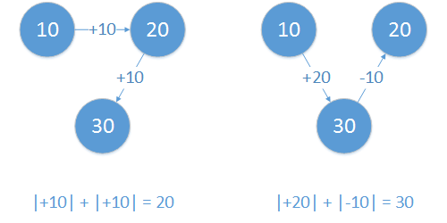

Problem Statement
==
あなたは、N 個の都市をそれぞれ 1回 ずつ旅行しようとしている。
都市を訪れる順番は様々考えられるが、訪れる都市の温度の変化が大きすぎると体調に響いて大変である。
したがって、隣り合う都市の温度差の絶対値の合計が、最も小さくなるような旅行をしたい。
それぞれの都市の気温データが与えられるので、温度差の合計の最小値を求めよ。

>You plan to visit to N cities once.
Although there are many possible routes for visiting cities, a temperature difference between two cities has an affect on your physical condition.
Thus, you want to choose the best route where the sum of the absolute temperature difference values between neighboring cities is minimum.
Given temperature values of each city, calculate the minimum sum of the absolute temperature difference values.

 
Figure: 旅行の例。(A Route example) 
左の旅行では温度差の絶対値の合計が20となるが、右の旅行では30となる。 
(The sums in the left and right routes are 20 and 30, respectively.)

Input
==
入力は複数のデータセットから成る。
各データセットは、以下の形式で与えられる。

>The input consists of multiple sets of data.
Each data set is given with the following format.

<pre>
N
T1 T2 ... TN
</pre>

1行目に、都市の数Nが与えられる (2 <= N <= 100)。

2行目に、各都市の気温データが与えられる。
Tiは i 番目の都市の気温を表す (-50 <= Ti <= 50)。

入力の終了は、"0"と書かれた1行によって示される。

>N is the number of cities (2 <= N <= 100).
Ti is a temperature in the ith city (-50 <= Ti <= 50).

>The end of the input is represented as the line "0".

Output
==
各データセットに対して、温度差の合計の最小値を1行ずつ出力せよ。

なお、入力の終了を示す"0"に対しては何も出力しないこと。

>Write the minimum sum of the absolute temperature difference on every other line with respect to each data set.

>Note that write NOTHING to the line "0" indicating the end of the input.

Sample Input
==
<pre>
3
10 20 30
5
-10 30 0 20 -30
0
</pre>

Sample Output
==
<pre>
20
60
</pre>

